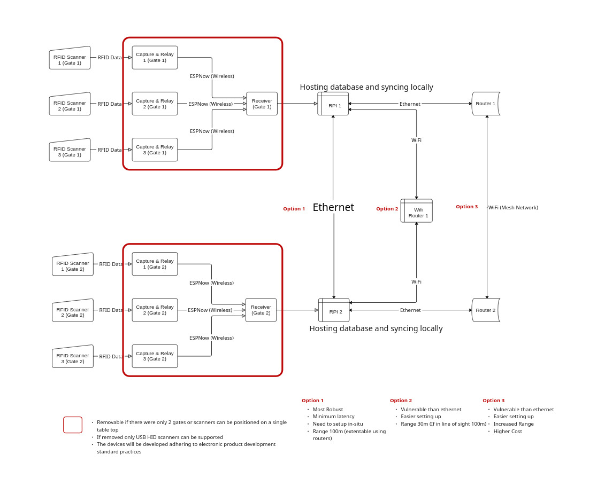

# RFID Access Control System – Multi-Gate Architecture

This project implements an **RFID-based access control system** that supports **multiple gates**, each managed by its own Raspberry Pi and RFID scanner interface.  
The system is designed for **offline-first operation**, with local databases that synchronize across all gates in real time without relying on cloud infrastructure.

---

## System Overview

- Each gate has a **Raspberry Pi** hosting a local **MariaDB** instance.  
- A **custom ESP32-S3 capture & relay device** collects UID data from RFID scanners and forwards it to the gate’s Raspberry Pi via a **receiver ESP32**.  
- The Pi checks the UID against the local database, logs the attempt, and returns a decision (PASS/FAIL).  
- The ESP32 provides **LED and buzzer feedback** for user interaction.  
- All Raspberry Pis synchronize their databases over the local network, ensuring **consistent access records** across gates.

---

## Data Flow

1. **RFID Capture**
   - RFID scanners (USB HID, RS232, UART) connect to **ESP32-S3 capture & relay modules**.  
   - Data is transmitted wirelessly to a **receiver ESP32** at the gate.

2. **Gate Node Processing**
   - The **receiver ESP32** passes data to the gate’s Raspberry Pi.  
   - The Pi logs the event in its **MariaDB** instance and checks user authorization.  
   - Access status (PASS/FAIL) is sent back to the ESP32 for **LED/audio output**.

3. **Database Synchronization**
   - Each Raspberry Pi hosts its own database to remain functional offline.  
   - Nodes are interconnected via **Ethernet** or **local WiFi**, synchronizing in real time.  
   - For 2 gates, Pis can be directly connected; for more, they connect through a **switch or routers**.

---

## Network Architecture Options

From the block diagram, three networking approaches are considered:

- **Option 1 – Ethernet Backbone (Recommended)**
  - Most robust, minimum latency  
  - Setup required on-site  
  - Range 100m (extendable with routers)  

- **Option 2 – Local WiFi Router**
  - Easier setup compared to Ethernet  
  - More vulnerable to interference  
  - Effective range ~30m indoors (100m line of sight)  

- **Option 3 – WiFi Mesh Network**
  - Simplest to scale  
  - Higher range and flexibility  
  - Increased cost, less robust than Ethernet  

---

## Key Features

- **Scalable multi-gate setup** (add new Pis + scanners easily)  
- **Modular scanner compatibility** (USB HID, RS232, UART)  
- **Offline-first resilience** (no reliance on internet/cloud)  
- **Real-time user feedback** (LED + buzzer outputs)  
- **Local DB synchronization** ensures global consistency  

---

## Technologies Used

- **Hardware**:  
  - Raspberry Pi (per gate)  
  - ESP32-S3 (capture & relay, receiver)  
  - RFID scanners (USB HID, RS232, UART)  
  - LEDs + buzzers  

- **Software**:  
  - MariaDB (local DB with sync)  
  - Custom ESP32 firmware (relay & feedback logic)  
  - Python/Node.js backend services  

---

## Block Diagram

*Diagram: Multi-gate RFID access control system with capture devices, receivers, Raspberry Pis, and database synchronization.*
